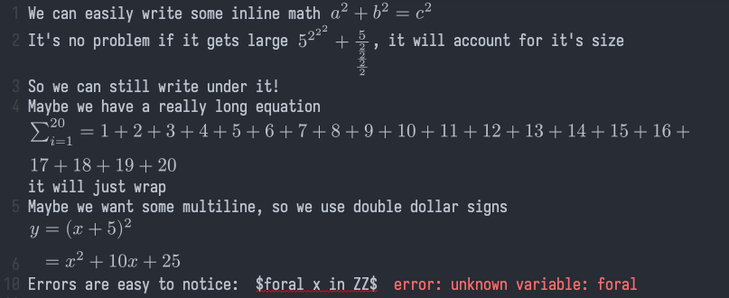

<div align="center">
  
# org-typst-preview

</div>

Live inline math previews for Emacs Org mode, for [Typst](https://typst.app) instead of LaTeX. So you can take notes right in the buffer with simple syntax. 

## Demo

<p align="center">
  
</p>

```
We can easily write some inline math $a^2 + b^2 = c^2$
It's no problem if it gets large $5^2^2^2 + 5/(2/2/2/2)$, it will account for it's size
So we can still write under it!
Maybe we have a really long equation $sum_(i=1)^20 = 1 + 2 + 3 + 4 + 5 + 6 + 7 + 8 + 9 + 10 + 11 + 12 + 13 + 14 + 15 +16 + 17 + 18 + 19 + 20$ it will just wrap
Maybe we want some multiline, so we use double dollar signs
$$
y &= (x+5)^2 \
&= x^2 + 10x + 25
$$
Errors are easy to notice:  $foral x in ZZ$
```

## Features

- **Live preview** — renders when cursor exists equation, goes back to source on entry.
- **Multi-line display math** — `$$...$$` may span several lines and open
  on its own line; inline `$...$` stays on one line so prose and prices
  never pair up across lines.
- **Asynchronous** — compilation runs in background processes (at most
  `org-typst-preview-max-processes` at a time); Emacs never blocks, even
  with many fragments.
- **Self-managing cache** — equations are rendered as images, and are saved to a cache to avoid re-rendering; while also garbage collecting to minimize space used.
- **Baseline-aligned** — every render measures the equation's true inline
  baseline, so images sit on the text baseline like real typography.
  Even deep fractions and matrices land on the baseline instead of
  floating above it.
- **Reflows to fit** — math wider than the window is re-laid-out by Typst
  at the window width, flowing onto multiple lines instead of running off
  the edge; display math keeps its large operator glyphs while flowing,
  and it returns to one line when the window widens. While a re-wrap
  compiles, or if the math has no legal break point, the fragment shows
  as plain text. (An alternative `scale` mode shrinks the image instead —
  see [Overflow styles](#overflow-styles).)
- **Theme- and zoom-aware** — glyphs use your theme's foreground colour
  on a transparent background, rendered at your font's size, and previews
  follow `text-scale-adjust` (`C-x C-+`) zooming.
- **Forgiving** — broken math stays as plain text with a red wavy
  underline and Typst's own message inline right after it (e.g.
  `error: unknown variable: frall`), clearing the moment you edit the
  fragment; the full compiler output for the most recent failure is in
  `*org-typst-preview-errors*`. Money like "I paid $5" is ignored, `\$`
  escapes a literal dollar sign, and code blocks are left alone.

## Getting started

### Requirements

- Emacs 27.1+ (SVG support recommended; falls back to PNG without it).
- The [`typst` CLI](https://github.com/typst/typst) on your `PATH`
  (`brew install typst` on macOS). Tested with Typst 0.15; a recent
  version is recommended.

### Installation

Not on MELPA yet, install manually. 

Put [org-typst-preview.el ⬇](https://raw.githubusercontent.com/FaysalAriss/org-typst-preview/refs/heads/main/org-typst-preview.el) somewhere on your `load-path`:
``` bash
curl --output-dir ~/.emacs.d -O https://raw.githubusercontent.com/FaysalAriss/org-typst-preview/refs/heads/main/org-typst-preview.el
```

Then:

```elisp
(use-package org-typst-preview
  :ensure nil
  :load-path "path/to/org-typst-preview"
  :hook (org-mode . org-typst-preview-mode))
```
or:

```elisp
(require 'org-typst-preview)
(add-hook 'org-mode-hook #'org-typst-preview-mode)
```


### Customization

`M-x customize-group RET org-typst-preview`, or set any of these with
`setq`:

| Variable                             | Default   | Purpose                                                        |
|--------------------------------------|-----------|----------------------------------------------------------------|
| `org-typst-preview-overflow-style`   | `wrap`    | what to do with math wider than the window: `wrap` / `scale`   |
| `org-typst-preview-scale`            | `1.0`     | extra image scaling if math looks too small/large              |
| `org-typst-preview-delay`            | `0.25`    | idle seconds before re-scanning                                |
| `org-typst-preview-program`          | `"typst"` | path to the typst executable                                   |
| `org-typst-preview-max-processes`    | `4`       | concurrent typst compiles                                      |
| `org-typst-preview-cache-dir`        | `~/.emacs.d/org-typst-preview-cache` | image cache (safe to delete) |
| `org-typst-preview-cache-max-bytes`  | `50000000` | soft cap on cache size in bytes (`nil` disables)              |
| `org-typst-preview-cache-max-age-days` | `30`    | delete images untouched this many days (`nil` disables)        |

#### Size

Math is rendered at your buffer font's size. If it reads a little larger
or smaller than your text, nudge the scale (values below `1.0` shrink it,
above `1.0` enlarge it):

```elisp
(setq org-typst-preview-scale 0.94)   ; a good starting point if math looks large
```

#### Overflow styles

What happens when math is wider than the window:

- **`wrap`** (default) — Typst re-lays the math out at the window width
  so it flows onto multiple lines at a constant font size, like text.
- **`scale`** — the image shrinks to fit (the font looks smaller when
  space is tight).

```elisp
(setq org-typst-preview-overflow-style 'wrap)   ; or 'scale
```

### Usage

Just write math between dollar signs in any Org buffer:

| You type                             | You get                          |
|--------------------------------------|----------------------------------|
| `$x^2 + y^2 = z^2$`                  | inline math                      |
| `$$integral_0^oo e^(-x^2) dif x$$`  | display-style math               |
| a `$$...$$` block across lines        | multi-line display math          |
| `\$5 and \$10`                       | literal dollar signs, no math    |

Interactive commands:

- `M-x org-typst-preview-buffer` — enable previews and render everything now
- `M-x org-typst-preview-clear` — remove previews and stop auto-rendering
- `M-x org-typst-preview-mode` — toggle the minor mode
- `M-x org-typst-preview-prune-cache` — trim the image cache to its caps now
- `M-x org-typst-preview-clear-cache` — delete every cached image

The cache is also pruned automatically once per session, so you rarely
need these last two by hand.

Suggested keybindings:

```elisp
(with-eval-after-load 'org
  (define-key org-mode-map (kbd "C-c t p") #'org-typst-preview-buffer)
  (define-key org-mode-map (kbd "C-c t c") #'org-typst-preview-clear))
```

## Roadmap

- [ ] **Publish to MELPA** so it installs without a manual `load-path`.
- [ ] **Org export integration** — today previews are display-only; make
      Typst math render when exporting Org to HTML/PDF.

## Notes & limitations

- Inline `$...$` must stay on one line; display `$$...$$` may span lines.
- Two prices on one line (`$10 ... 100$`) can pair up as math; escape
  with `\$` when that happens.
- Images are cached per foreground colour, so switching themes re-renders
  fragments once to match.
- Because rendered images follow real ink extents, a line with tall math
  (big exponents, integrals, deep fractions) grows slightly taller than a
  plain line.
- Math with no legal break point shows as plain text when it cannot fit.
  An image is never displayed wider than its window, which also avoids an
  Emacs redisplay hang that occurs when an image overflows the window
  while `visual-line-mode` and `display-line-numbers-mode` are both on.
- Math is rendered at your buffer font's size; if it reads a little
  bigger or smaller than your text, nudge `org-typst-preview-scale` (it
  multiplies the rendered size).

## Prior art

org-typst-preview builds on two projects' ideas:

- [xenops](https://github.com/dandavison/xenops) has per fragment
  asynchronous rendering with content-keyed on-disk caching for LaTeX.
- The [org-latex-preview overhaul](https://github.com/karthink/org-preview)
  (now part of newer Org) added baseline alignment, theme-matched
  foreground colours, and `text-scale` tracking.

This package borrows both and applies them to Typst, whose millisecond
compiles make the render-on-cursor-exit loop feel instant. The baseline
alignment necessarily works differently: with no dvipng `--depth` to
read, each render carries a second Typst page with a marker hung from the
line baseline, and the height difference gives the true inline baseline —
which stays correct even for stacked math (deep fractions, matrices) that
a naive baseline query would place too high.

## Development

Run the test suites (they compile real Typst, so the CLI must be
installed):

```sh
emacs -Q --batch -l tests/test-org-typst-preview.el
emacs -Q --batch -l tests/test-org-typst-preview-e2e.el
```

## License

GPL-3.0-or-later — see [LICENSE](LICENSE).
